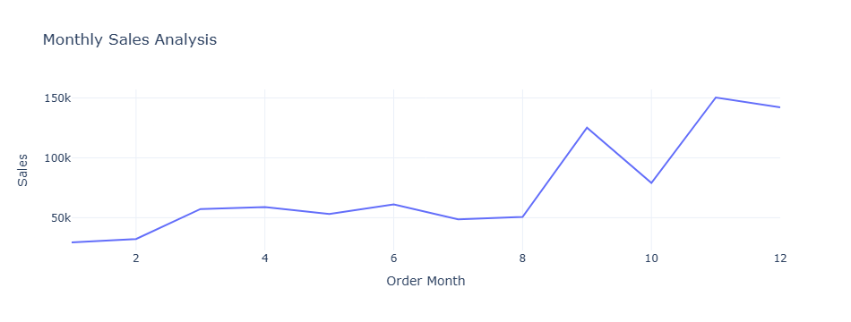
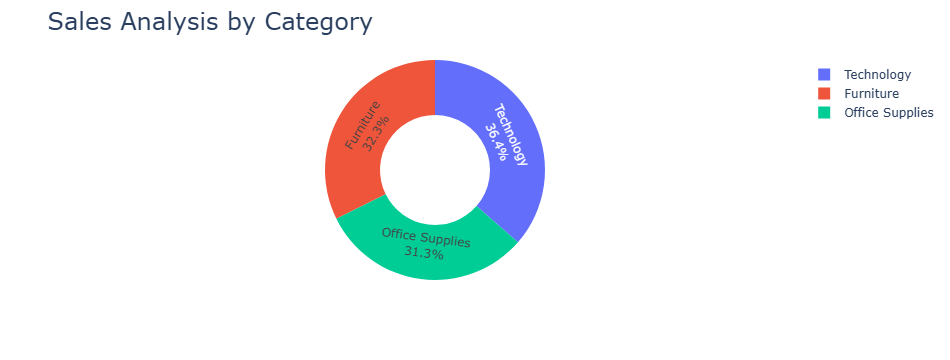
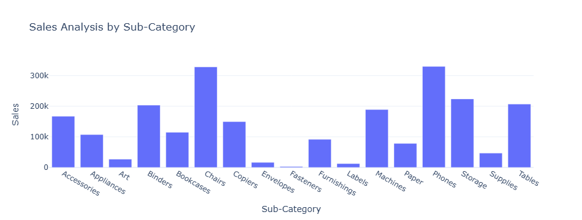
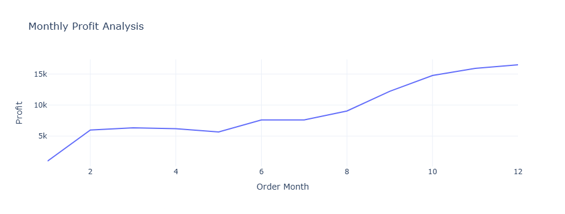
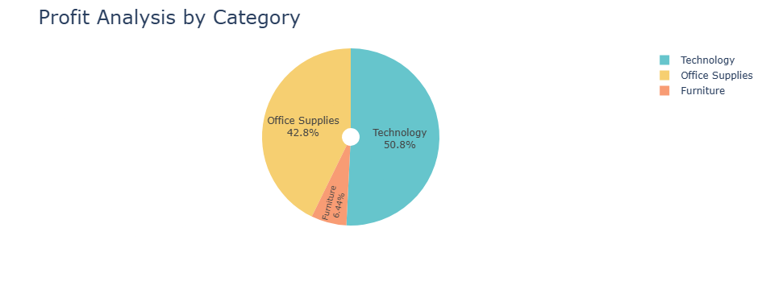
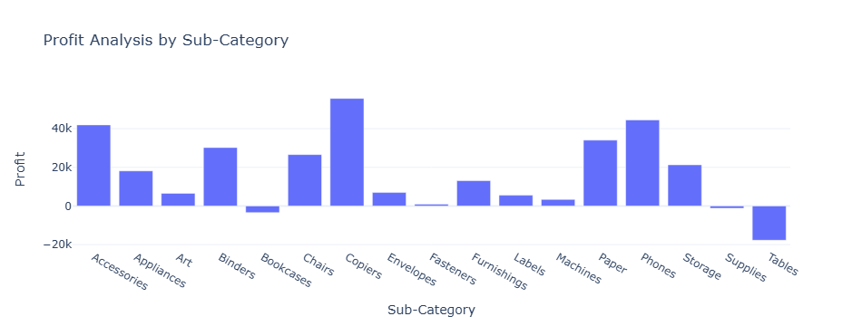
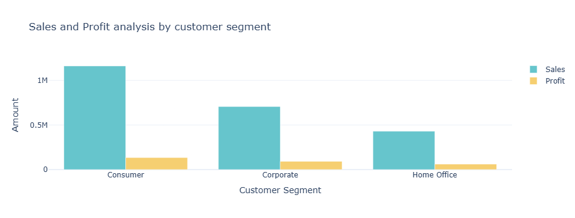
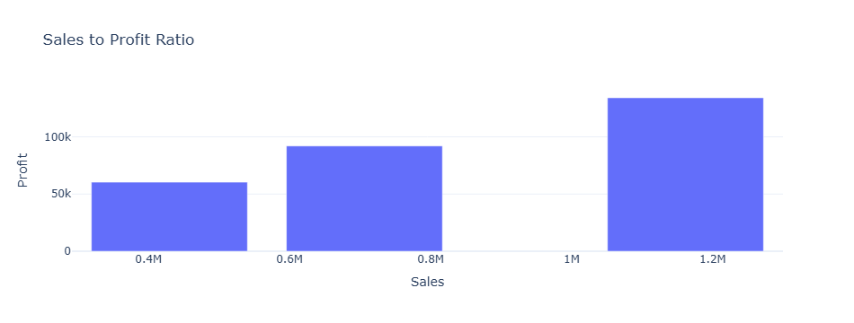

# 🏬 Superstore Sales Data Analysis

This project performs an **Exploratory Data Analysis (EDA)** on the **Superstore Sales dataset** to uncover insights about customer segments, sales, profit distribution, and discount impacts. The analysis highlights regional performance, product profitability, and sales-to-profit ratios across categories.

---

## 📌 Project Overview

The project focuses on:

* Understanding which **categories and sub-categories** drive sales and profit.
* Evaluating **customer segments** and their contribution to revenue.
* Identifying **loss-making products** due to discounts.
* Comparing **regional performance** in terms of sales and profit.

---

## 📂 Dataset

The dataset used in this analysis is `Superstore.csv`.
It contains **9,994 rows × 21 columns** with the following details:

* **Order details**: Order ID, Order Date, Ship Mode
* **Customer details**: Customer Name, Segment
* **Geography**: Country, City, Region
* **Product info**: Category, Sub-Category, Product Name
* **Financials**: Sales, Quantity, Discount, Profit


---

## 🔑 Key Questions Answered

1. Which **category** generates the highest sales and profit?

   


2. Analyze sales based on product categories and determine which category has

   


3. The sales analysis needs to be done based on sub-categories.

   


4. You need to analyze the monthly profit from sales and determine which month had the
highest profit.

   


5. Analyze the profit by category and sub-category.



   

6. Analyze the sales and profit by customer segment




7. Analyze the sales to profit ratio


---


## 📊 Analysis & Visualizations

The notebook includes:

* **Bar plots** for category and segment performance.
* **Pie charts** for sub-category contribution.
* **Histograms** for profit and discount distribution.
* **Heatmaps** for regional insights.
* **Scatter plots** for sales vs. profit.

---

## 🛠️ Tech Stack

* **Python**
* **Pandas** → data handling
* **NumPy** → numerical computations
* **Plotly** → interactive visualizations
* **Jupyter Notebook** → analysis environment

---

## 🚀 How to Run

1. Clone the repository or download the notebook.
2. Install dependencies:

   ```bash
   pip install pandas numpy plotly notebook
   ```
3. Place the dataset (`Superstore.csv`) in the same folder as the notebook.
4. Open the notebook:

   ```bash
   jupyter notebook ef5b7590-79c6-451a-9e7f-fd722ddf743f.ipynb
   ```
5. Run the notebook cell by cell.

---

## 📈 Insights

* **Technology** is the top-selling category but not always the most profitable.
* **Consumer segment** generates the largest share of revenue.
* **Tables** category often incurs losses due to high discounts.
* **Western region** leads in overall sales.
* Profitability is highly dependent on **discount strategy**.

---

## 📌 Future Improvements

* Build a **dashboard** (e.g., with Power BI or Streamlit).
* Create a **predictive model** to forecast sales and profit.
* Apply **clustering** to segment customers based on spending.

---

👨‍💻 Author: Anand Saundarya
📅 Date: September 2025

---

👉 Do you want me to **export this into a ready-to-use `README.md` file** so you can upload directly to GitHub?
